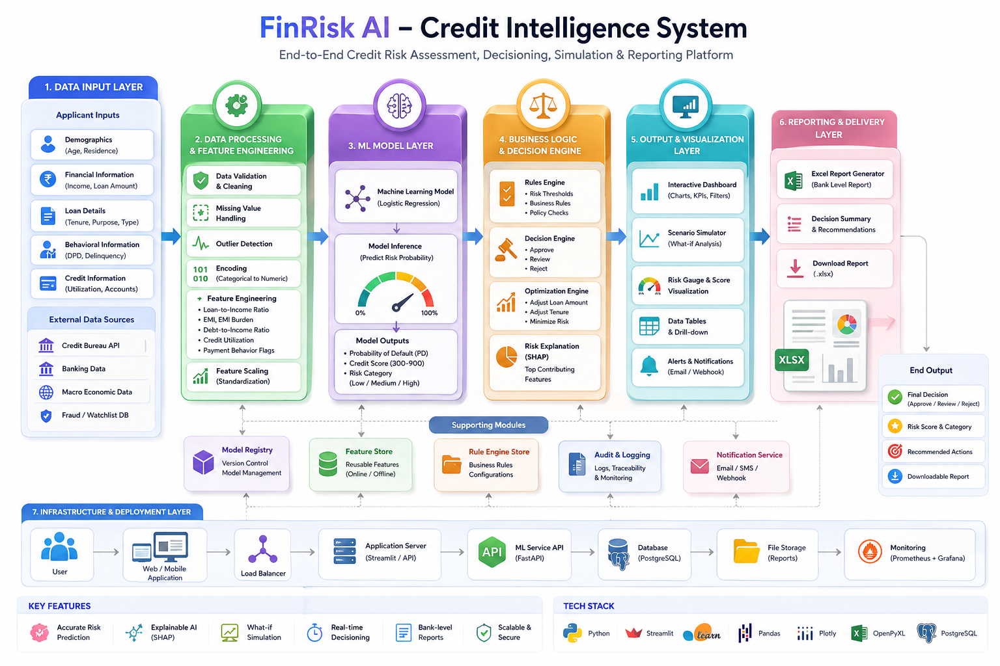

<<<<<<< HEAD
#  FinRisk AI – Credit Intelligence System
=======
# FinRisk AI – Credit Intelligence System
>>>>>>> 14813d9 (Updated README)

### End-to-End Credit Risk Assessment, Simulation and Decision Platform

---

<<<<<<< HEAD
##  Live Demo

👉 *Link*

---

##  Project Overview
=======


---

## Live Demo
>>>>>>> 14813d9 (Updated README)

Access the deployed application:
https://finrisk-intelligence.streamlit.app

---

<<<<<<< HEAD
##  Key Features
=======
## Support the Project
>>>>>>> 14813d9 (Updated README)

If you find this project useful, consider giving it a star.
It helps improve visibility and supports further development.

---

## Project Preview

### Dashboard

*Add screenshot here (assets/dashboard.png)*

### Risk Analysis

*Add screenshot here (assets/risk.png)*

### Simulator

*Add screenshot here (assets/simulator.png)*

### Excel Report

*Add screenshot here (assets/report.png)*

---

## Table of Contents

* Overview
* Why This Project Matters
* Features
* Architecture Diagram
* System Architecture
* How It Works
* Input Data Description
* Feature Engineering
* Machine Learning Model
* Decision Engine
* Scenario Simulator
* Optimization Engine
* Dashboard
* Report Generation
* Key Outputs
* Use Cases
* Tech Stack
* Project Structure
* Installation
* Usage
* Deployment
* Performance
* Limitations
* Future Improvements
* Contributing
* License
* Acknowledgment
* Author

---

## Overview

FinRisk AI is a production-inspired credit risk intelligence system that replicates how banks and fintech platforms evaluate loan applicants using machine learning, financial metrics, and decision rules.

It provides real-time risk prediction, explainability, simulation capabilities, and bank-level reporting.

---

<<<<<<< HEAD
##  Project Architecture
=======
## Why This Project Matters

This project demonstrates:

* Real-world credit risk modeling
* End-to-end system design
* Financial domain understanding
* Explainable AI implementation
* Production-style dashboard development

It bridges the gap between academic ML projects and real fintech systems.

---

## Features

* Credit Risk Prediction (Probability of Default)
* Credit Score Generation (300–900 scale)
* Decision Engine (Approve / Review / Reject)
* Explainable AI (Feature Importance)
* Scenario Simulation (What-if analysis)
* Loan Optimization Engine
* Interactive Dashboard (Power BI style)
* Bank-level Excel Report Generation

---

## Architecture Diagram

*Add architecture diagram here*

Example:

```md

```

---

## System Architecture

User Input → Feature Engineering → ML Model → Decision Engine → Dashboard → Report

The system is modular and follows a pipeline similar to real banking systems.

---

## How It Works

1. User enters applicant data
2. System validates and processes inputs
3. Feature engineering computes financial metrics
4. Machine learning model predicts default probability
5. Decision engine applies business rules
6. Dashboard displays insights and charts
7. Excel report is generated for download

---

## Input Data Description

### Demographics

* Age
* Residence Type

### Financial

* Income
* Loan Amount
* Loan Tenure

### Behavioral

* Average DPD (Days Past Due)
* Delinquency Ratio
* Credit Utilization
* Number of Open Accounts

### Loan Context

* Loan Type (Secured / Unsecured)
* Loan Purpose

These features are selected based on real-world credit risk indicators used in banking systems.

---

## Feature Engineering

Derived metrics include:

* Loan-to-Income Ratio
* EMI Calculation
* EMI Burden
* Debt-to-Income Ratio
* Risk Flags

These features improve predictive performance and reflect financial behavior.

---

## Machine Learning Model

Model: Logistic Regression

Reasons:

* Interpretable
* Fast
* Industry-standard baseline

Outputs:

* Probability of Default
* Credit Score
* Risk Category

---

## Decision Engine

Rules applied:

* Probability < 0.3 → Approve
* 0.3–0.6 → Review
* > 0.6 → Reject

Additional constraints:

* High EMI burden → increased risk
* High delinquency → stricter decision

---

## Scenario Simulator

Users can modify:

* Income
* Loan amount
* Tenure

The system recalculates risk in real time to simulate different scenarios.

---

## Optimization Engine

Finds optimal loan configuration by:

* Adjusting loan amount
* Modifying tenure
* Minimizing risk probability

---

## Dashboard

* KPI Cards (Risk, Score, LTI)
* Gauge Chart (Risk %)
* Feature Importance Chart
* Filters and Tabs
* Drill-down analytics

Designed to mimic modern fintech dashboards.

---

## Report Generation

Excel report includes:

### Summary Sheet

* Risk Probability
* Credit Score
* Decision

### Inputs Sheet

* All applicant data

### Importance Sheet

* Feature importance with visualization

Reports are formatted to resemble bank-level documentation.

---

## Key Outputs

* Default Probability: Example ~66%
* Credit Score: Example ~500
* Risk Category: Medium Risk
* Loan-to-Income Ratio: Example ~2.13

---

## Use Cases

* Banks and NBFCs
* Fintech lending platforms
* Credit risk analysts
* Loan underwriting systems

---

## Tech Stack

Frontend:

* Streamlit

Backend:

* Python

Machine Learning:

* Scikit-learn

Data Processing:

* Pandas, NumPy

Visualization:

* Plotly

Reporting:

* OpenPyXL

---

## Project Structure
>>>>>>> 14813d9 (Updated README)

```
finrisk-ai/
│
├── app/
│   └── app.py
├── assets/
│   ├── architecture.png
│   ├── dashboard.png
│   ├── simulator.png
│   ├── report.png
│
├── models/
├── reports/
├── requirements.txt
└── README.md
```

---

<<<<<<< HEAD
## 📊 Model Performance

| Model               | Accuracy | Recall  |
| ------------------- | -------- | ------- |
| Logistic Regression | **93%**  | **94%** |
| Random Forest       | ~91%     | ~90%    |
| XGBoost             | ~92%     | ~91%    |

👉 Logistic Regression chosen for:

* High recall (important in finance)
* Interpretability (regulatory requirement)

---

##  Explainability (Why Prediction?)

The system uses **SHAP (SHapley Additive Explanations)** to:

* Identify top influencing features
* Visualize contribution of each feature
* Explain individual predictions clearly

---

##  Example Dashboard Features

* Default probability visualization
* Credit score calculation
* Risk gauge (green → yellow → red)
* Feature importance chart
* SHAP waterfall plot
* Decision explanation panel

---

##  Tech Stack

* Python
* Scikit-learn
* Pandas / NumPy
* SHAP (Explainable AI)
* Plotly (visualizations)
* Streamlit (UI)
* Joblib (model serialization)

---

##  Installation & Setup

### 1. Clone Repository
=======
## Installation
>>>>>>> 14813d9 (Updated README)

```bash
git clone https://github.com/your-username/finrisk-ai.git
cd finrisk-ai
pip install -r requirements.txt
streamlit run app/app.py
```

---

## Usage

1. Enter applicant details
2. Click "Analyze Applicant"
3. View risk metrics and charts
4. Use simulator for scenario analysis
5. Download Excel report

---

<<<<<<< HEAD
##  How It Works
=======
## Deployment
>>>>>>> 14813d9 (Updated README)

Deployed using Streamlit Cloud

Steps:

1. Push code to GitHub
2. Connect repository to Streamlit
3. Set main file path (app/app.py)
4. Deploy

---

## Performance

* Fast inference (<100ms)
* Real-time updates
* Lightweight architecture

---

<<<<<<< HEAD
##  Future Improvements
=======
## Limitations
>>>>>>> 14813d9 (Updated README)

* No real credit bureau data
* Simplified assumptions
* Interest rate partially modeled

---

<<<<<<< HEAD
##  Key Learnings
=======
## Future Improvements
>>>>>>> 14813d9 (Updated README)

* Real dataset integration
* Advanced ML models (XGBoost, Deep Learning)
* Interest rate optimization
* API-based architecture
* User authentication system

---

## License

<<<<<<< HEAD
**Bandi Jaswanth Reddy**

* GitHub: **
* LinkedIn: **
=======
This project is intended for educational and demonstration purposes.
>>>>>>> 14813d9 (Updated README)

---

## Acknowledgment

Inspired by real-world fintech systems and credit risk modeling practices.

---

## Author

Jaswanth Reddy
BTech – Artificial Intelligence and Data Science

---
